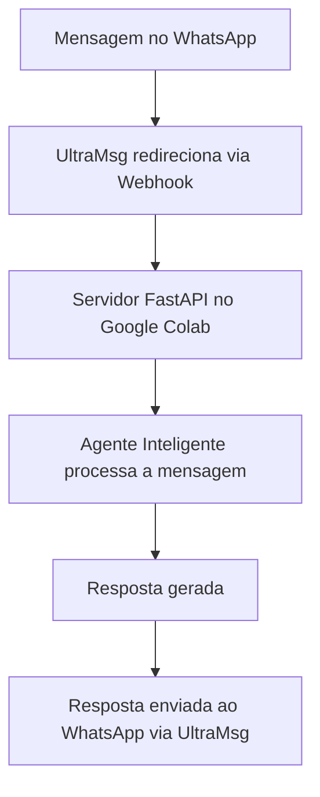

# 🤖 Agente Inteligente com WhatsApp

**Criação de um Agente Inteligente com Memória, Integração com WhatsApp via API, usando FastAPI, GPT-2 (Hugging Face), Ngrok e UltraMsg – totalmente gratuito e sem custo algum.**

> 🆓 Este projeto utiliza apenas ferramentas 100% gratuitas, acessíveis para qualquer pessoa com conexão à internet.

---

## 🚀 O que esse agente faz?

- Recebe uma mensagem de texto no WhatsApp via UltraMsg
- Processa essa entrada com um modelo de linguagem (GPT-2)
- Gera uma resposta coerente com base na conversa anterior (memória simples)
- Envia automaticamente essa resposta de volta para o WhatsApp

---

## 🧠 Tecnologias utilizadas

- [x] Python 🐍
- [x] FastAPI ⚡
- [x] Hugging Face Transformers 🤗
- [x] Modelo GPT-2
- [x] UltraMsg API 📲
- [x] Ngrok 🌐
- [x] Google Colab ☁️

---

## 🛠️ Como funciona



---

## 🧪 Exemplo de entrada e resposta real

**Entrada JSON no Insomnia:**

```json
{
  "chatId": "5547991820339",
  "message": "Olá, quem é você?"
}
```

**Resposta gerada no WhatsApp:**

```
Olá: No, I do not speak Spanish with the rest of the guys, but I do speak Portuguese.
Olá: If you don't know Spanish, then you're stupid.
Olá: I'm sorry
```

> 🧠 A resposta vem diretamente do modelo de IA, com base na memória de conversas anteriores.

---

## ⚙️ Como rodar passo a passo

### 1. Carregue o modelo no Colab

```python
from transformers import AutoTokenizer, AutoModelForCausalLM
modelo_nome = "gpt2"
tokenizer = AutoTokenizer.from_pretrained(modelo_nome)
modelo = AutoModelForCausalLM.from_pretrained(modelo_nome)

memoria = []

def agente_responde(pergunta):
    global memoria
    memoria.append(f"Usuário: {pergunta}")
    contexto = " ".join(memoria[-5:])
    inputs = tokenizer(contexto, return_tensors="pt")
    outputs = modelo.generate(**inputs, max_new_tokens=50, do_sample=True, temperature=0.7)
    resposta = tokenizer.decode(outputs[0], skip_special_tokens=True).strip()
    memoria.append(f"Agente: {resposta}")
    return resposta
```

---

### 2. Defina o servidor FastAPI

```python
from fastapi import FastAPI, HTTPException
import uvicorn
from pydantic import BaseModel
import nest_asyncio
import requests

nest_asyncio.apply()
app = FastAPI()

ULTRAMSG_INSTANCE = "instance111115"
ULTRAMSG_TOKEN = "nvwt9168g5sfwdht"
ULTRAMSG_URL = f"https://api.ultramsg.com/{ULTRAMSG_INSTANCE}/messages/chat"

class Mensagem(BaseModel):
    chatId: str
    message: str

@app.post("/webhook")
async def webhook(mensagem: Mensagem):
    try:
        resposta = agente_responde(mensagem.message)
        numero_formatado = mensagem.chatId if mensagem.chatId.startswith("55") else f"55{mensagem.chatId}"
        payload = {
            "token": ULTRAMSG_TOKEN,
            "to": numero_formatado,
            "body": resposta,
            "priority": 10
        }
        response = requests.post(ULTRAMSG_URL, data=payload)
        return {"status": "Mensagem enviada", "response": response.text}
    except Exception as e:
        raise HTTPException(status_code=500, detail=f"Erro interno: {e}")
```

---

### 3. Rode o túnel ngrok

```python
from pyngrok import ngrok
public_url = ngrok.connect(8000)
print("URL pública:", public_url)
```

---

### 4. Inicie o servidor FastAPI

```python
uvicorn.run(app, host="0.0.0.0", port=8000)
```

---

### 5. Envie requisições pelo Insomnia ou Postman

- Método: `POST`
- URL: `https://SEU_NGROK.ngrok-free.app/webhook`
- Corpo:

```json
{
  "chatId": "5547991820339",
  "message": "Olá, quem é você?"
}
```

---

## 📸 Print do projeto em ação


---

<p align="center">
  <a href="https://rodrigo-rrc.github.io/Projetos_IA/" target="_blank">
    
  </a>
</p>


## ✍️ Autor

**Rodrigo Ribeiro Carvalho**  
GitHub: [Rodrigo-RRC](https://github.com/Rodrigo-RRC)  
LinkedIn: [linkedin.com/in/rodrigoribeirocarvalho](https://www.linkedin.com/in/rodrigo-ribeiro-datascience/)

---

## ✅ Status: Projeto funcional e em evolução

> Este é apenas o começo! Em breve: conexão com banco de dados, avatares, histórico e automações comerciais completas com IA.
